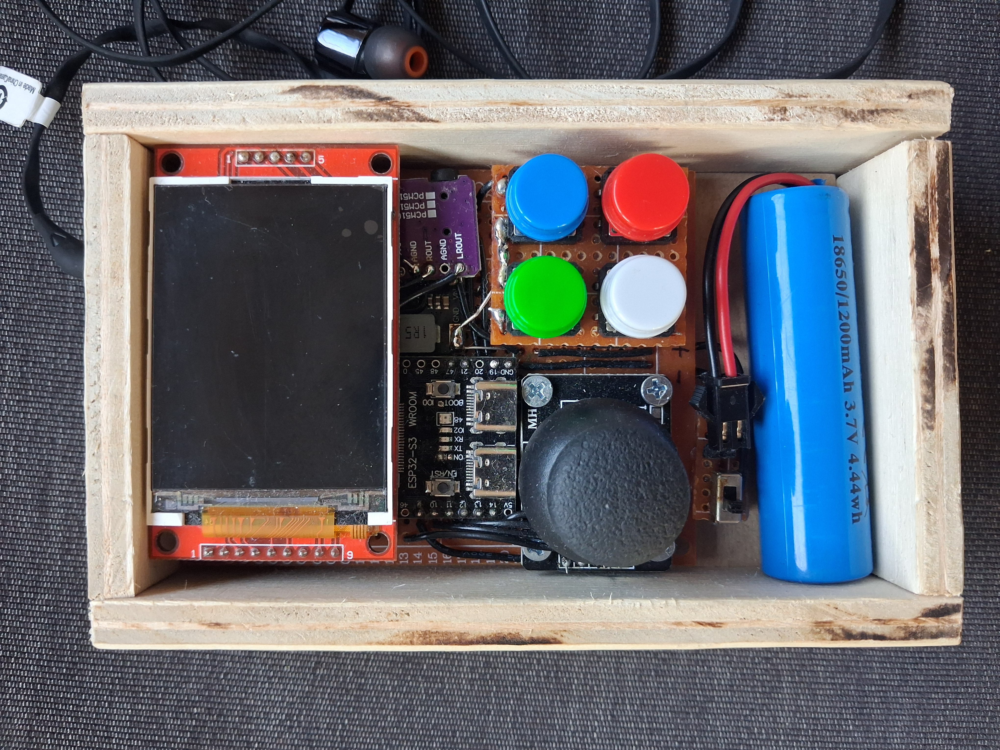

# RETROWOOD S3
- Status: completed
- Ref:

# Hardware info
- ESP32-S3 WROOM N16R8 CAM Development board (includes LED, WS2812 and Micro-SD reader)
- 320x240 SPI LCD 2.2" using ILI9341
- I2S PCM5102A DAC Decoder
- TPS63020 3,3 V Boost Buck
- UP/DOWN/LEFT/RIGHT using an analog stick and ADCs
- SELECT/START/A/B are connected directly to GPIOs
- 1200 mAh Li-Ion battery

# Known issues:
- Better kill red power LEDs of ESP32, PCM5102A and TPS63020 as they consume energy and are quite bright at low light coditions.

# Images

